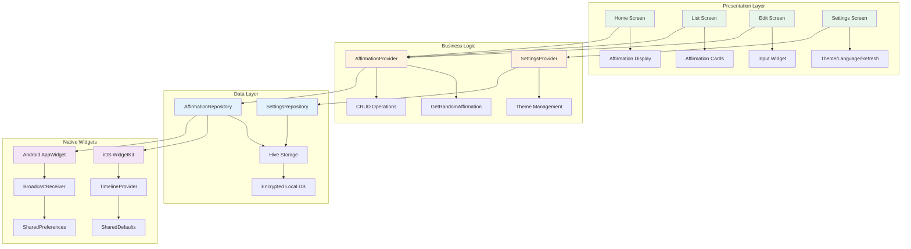

# 🌟 Myself 2.0

> *Transform your mindset, one affirmation at a time*

A beautiful, privacy-focused Flutter app that helps you stay motivated through personalized affirmations delivered right to your home screen. Built with a zen-inspired design philosophy, Myself 2.0 makes positive thinking effortless and accessible.

[](https://flutter.dev)
[](https://www.apple.com/ios)
[](https://www.android.com)

## ✨ Features Overview

**77 of 78 Features Completed** 🎉 | **98.7% Complete**

### 📱 Core Features

- ✅ **Create & Manage Affirmations** - Craft personalized affirmations with multi-line support (up to 280 characters)
- ✅ **Smart Widget Integration** - Beautiful home screen widgets for iOS and Android
- ✅ **Auto-Refresh on Unlock** - New affirmation every time you unlock your phone
- ✅ **Drag & Drop Reordering** - Organize your affirmations effortlessly
- ✅ **Import/Export** - Backup and share your affirmations
- ✅ **Offline First** - 100% functionality without internet connection
- ✅ **Zero Tracking** - Complete privacy, no analytics or data collection

### 🎨 Design & Experience

- ✅ **Zen-Inspired UI** - Calming design with Playfair Display & Inter fonts
- ✅ **Dark & Light Modes** - Beautiful themes that adapt to your preference
- ✅ **Smooth Animations** - Subtle fade-in effects and breathing animations
- ✅ **Responsive Layout** - Perfect on screens from 4" to 13"
- ✅ **Interactive Onboarding** - Welcoming first-time user experience

### 🌍 Accessibility & Localization

- ✅ **Full VoiceOver Support** (iOS) - Complete screen reader compatibility
- ✅ **TalkBack Support** (Android) - Accessible for all users
- ✅ **System Font Scaling** - Respects user font size preferences
- ✅ **Bilingual** - French (primary) and English support
- ✅ **44pt Touch Targets** - Easy interaction for all users
- ✅ **WCAG 2.1 AA Compliant** - 4.5:1 minimum contrast ratio

### ⚡ Performance & Security

- ✅ **< 2s Cold Start** - Lightning-fast app launch
- ✅ **< 500ms Widget Updates** - Near-instant refreshes
- ✅ **< 50MB Memory Footprint** - Lightweight and efficient
- ✅ **Encrypted Local Storage** - Your data stays secure
- ✅ **No Internet Permission** - Core features work completely offline

---

## 🏗️ Architecture



---

## 📋 Feature Breakdown by Category

### 🏗️ Infrastructure (6 Features)

| ID | Feature | Status |
|---|---|:---:|
| INFRA-001 | Flutter Project Setup with dependencies | ✅ |
| INFRA-002 | Feature-based folder structure | ✅ |
| INFRA-003 | Hive database configuration | ✅ |
| INFRA-004 | Provider state management | ✅ |
| COMPAT-001 | iOS 14.0+ compatibility | ✅ |
| COMPAT-002 | Android 8.0 (API 26)+ compatibility | ✅ |

### 🎯 Functional (32 Features)

<details>
<summary><b>Core Functionality</b></summary>

- ✅ **FUNC-001** - Affirmation data model with UUID, timestamps, character limit
- ✅ **FUNC-002** - Create new affirmations with validation
- ✅ **FUNC-003** - Edit existing affirmations
- ✅ **FUNC-004** - Delete affirmations with confirmation
- ✅ **FUNC-005** - List all affirmations with scrollable view
- ✅ **FUNC-006** - Multi-line text support
- ✅ **FUNC-007** - Drag-and-drop reordering
- ✅ **FUNC-008** - Repository pattern for CRUD operations
- ✅ **FUNC-009** - Smart random selection (no immediate repeats)
- ✅ **FUNC-010** - Settings persistence (theme, refresh mode, language)
- ✅ **FUNC-011** - Export to text file
- ✅ **FUNC-012** - Import from text file

</details>

<details>
<summary><b>Widget Integration</b></summary>

- ✅ **WIDGET-001** - home_widget package integration
- ✅ **WIDGET-002** - Data sharing via SharedDefaults/SharedPreferences
- ✅ **WIDGET-003** - iOS WidgetKit extension (Small/Medium/Large)
- ✅ **WIDGET-004** - iOS TimelineProvider with unlock refresh
- ✅ **WIDGET-005** - Android AppWidgetProvider (Small/Medium/Large)
- ✅ **WIDGET-006** - Android ACTION_USER_PRESENT BroadcastReceiver
- ✅ **WIDGET-007** - Tap to open app from widget
- ✅ **WIDGET-008** - Placeholder state for empty affirmations
- ✅ **WIDGET-009** - Real-time widget updates on data changes
- ✅ **WIDGET-011** - Widget rotation enable/disable setting
- ✅ **WIDGET-012** - Refresh interval settings (unlock/hourly/daily)

</details>

<details>
<summary><b>Localization</b></summary>

- ✅ **L10N-001** - Flutter intl package with ARB files
- ✅ **L10N-002** - Complete French translations
- ✅ **L10N-003** - Complete English translations
- ✅ **L10N-004** - Language selection with live UI update

</details>

### 🎨 UI/UX (21 Features)

<details>
<summary><b>Screens & Components</b></summary>

- ✅ **UI-001** - Zen color palette & typography (Playfair Display, Inter)
- ✅ **UI-002** - Light/Dark/System theme modes
- ✅ **UI-003** - Home screen with random affirmation display
- ✅ **UI-004** - Fade-in animations (300-500ms) & breathing effect
- ✅ **UI-005** - Swipe/tap gesture to cycle affirmations
- ✅ **UI-006** - Manual refresh button
- ✅ **UI-007** - Affirmation list screen with card layout
- ✅ **UI-008** - Create/edit screen with character counter
- ✅ **UI-009** - Reusable AffirmationCard widget (16px corners, elevation)
- ✅ **UI-010** - AffirmationInput widget with validation
- ✅ **UI-011** - Settings screen (theme, interval, language, font size)
- ✅ **UI-012** - Empty state with illustration
- ✅ **UI-013** - Onboarding welcome screen
- ✅ **UI-014** - Complete onboarding flow with widget setup
- ✅ **UI-015** - Success animation after first affirmation
- ✅ **UI-016** - Delete confirmation dialog
- ✅ **UI-017** - Font size adjustment with preview
- ⬜ **UI-018** - Dark mode toggle to settings page *(Pending)*
- ✅ **WIDGET-010** - Widget light/dark mode with blur effect
- ✅ **COMPAT-003** - Responsive 4" to 13" screen support

</details>

<details>
<summary><b>Accessibility</b></summary>

- ✅ **A11Y-001** - Full VoiceOver support (iOS)
- ✅ **A11Y-002** - Full TalkBack support (Android)
- ✅ **A11Y-003** - 44x44pt minimum touch targets
- ✅ **A11Y-004** - WCAG 4.5:1 color contrast
- ✅ **A11Y-005** - System font scaling support

</details>

### ⚡ Performance (4 Features)

- ✅ **PERF-001** - Cold start < 2 seconds
- ✅ **PERF-002** - Widget updates < 500ms
- ✅ **PERF-003** - Memory footprint < 50MB
- ✅ **PERF-004** - 100% offline functionality

### 🔒 Security (4 Features)

- ✅ **SEC-001** - Zero analytics/tracking
- ✅ **SEC-002** - No internet permission for core features
- ✅ **SEC-003** - Platform-native encryption
- ✅ **SEC-004** - No third-party data collection SDKs

### 🧪 Testing (10 Features)

- ✅ **TEST-001** - Affirmation CRUD unit tests
- ✅ **TEST-002** - Random selection algorithm tests
- ✅ **TEST-003** - Hive persistence layer tests
- ✅ **TEST-004** - Home screen widget tests
- ✅ **TEST-005** - Affirmation list widget tests
- ✅ **TEST-006** - Create/edit screen widget tests
- ✅ **TEST-007** - Theme switching tests
- ✅ **TEST-008** - Onboarding integration tests
- ✅ **TEST-009** - CRUD flow integration tests
- ✅ **TEST-010** - Widget-app sync integration tests

### 📚 Documentation (2 Features)

- ✅ **DOC-001** - Dartdoc comments on all public APIs
- ✅ **DOC-002** - In-app widget setup instructions

---

## 🚀 Getting Started

### Prerequisites

- **Flutter SDK** 3.0 or higher ([Install Flutter](https://flutter.dev/docs/get-started/install))
- **iOS Development**: Xcode 13+ (macOS only)
- **Android Development**: Android Studio with SDK 26+

### Installation

```bash
# Clone the repository
git clone https://github.com/yourusername/myself_2.0.git
cd myself_2.0

# Install dependencies
flutter pub get

# Run the app
flutter run
```

### Setup for Development

```bash
# Generate Hive type adapters (if modified)
flutter packages pub run build_runner build

# Run tests
flutter test

# Run integration tests
flutter test integration_test/

# Generate localization files
flutter gen-l10n
```

### Building for Production

```bash
# iOS
flutter build ios --release

# Android
flutter build apk --release
# or
flutter build appbundle --release
```

---

## 📦 Dependencies

| Package | Purpose |
|---------|---------|
| `provider` | State management |
| `hive` & `hive_flutter` | Local storage & encryption |
| `home_widget` | Native widget integration |
| `uuid` | Unique ID generation |
| `intl` | Internationalization |
| `google_fonts` | Playfair Display & Inter fonts |
| `flutter_animate` | Smooth UI animations |

---

## 📱 Widget Setup

### iOS

1. Long-press on home screen
2. Tap **+** button in top-left corner
3. Search for **Myself 2.0**
4. Choose your preferred size (Small, Medium, or Large)
5. Tap **Add Widget**

### Android

1. Long-press on home screen
2. Tap **Widgets**
3. Find **Myself 2.0**
4. Drag to desired location
5. Choose size and placement

---

## 🎨 Design Philosophy

Myself 2.0 embraces a **zen-inspired aesthetic** with:

- **Color Palette**: Cloud White, Deep Night, Soft Sage, Warm Sand
- **Typography**: Playfair Display (serif, elegant) for affirmations, Inter (sans-serif, clean) for UI
- **Animations**: Subtle, calming transitions (300-500ms fade-ins)
- **Spacing**: Generous padding for breathing room
- **Corners**: Soft 16px rounded corners throughout

---

## 🔐 Privacy Commitment

Myself 2.0 is built with **privacy-first principles**:

- ✅ **Zero data collection** - No analytics, no tracking
- ✅ **No internet permission** - Core features work 100% offline
- ✅ **Local encryption** - All data encrypted on device
- ✅ **No third-party SDKs** - No external data sharing
- ✅ **Open source** - Transparent codebase

Your affirmations stay **yours**, forever.

---

## 🌍 Supported Languages

- 🇫🇷 **French** (Primary)
- 🇬🇧 **English** (Secondary)

---

## 🧪 Testing

Myself 2.0 maintains **comprehensive test coverage**:

- **Unit Tests**: Core business logic, repositories, algorithms
- **Widget Tests**: All screens and components
- **Integration Tests**: Complete user flows (onboarding, CRUD, widget sync)

Run all tests:
```bash
flutter test --coverage
```

---

## 📄 License

This project is licensed under the MIT License - see the [LICENSE](LICENSE) file for details.

---

## 🙏 Acknowledgments

Built with ❤️ using:
- [Flutter](https://flutter.dev) - Beautiful native apps
- [Hive](https://pub.dev/packages/hive) - Lightning-fast local storage
- [home_widget](https://pub.dev/packages/home_widget) - Native widget integration

---

## 📞 Support

Have questions or feedback? Open an issue on GitHub!

---

<div align="center">

**Transform your mindset, one affirmation at a time** 🌟

Made with 💜 by the Myself 2.0 Team

</div>
